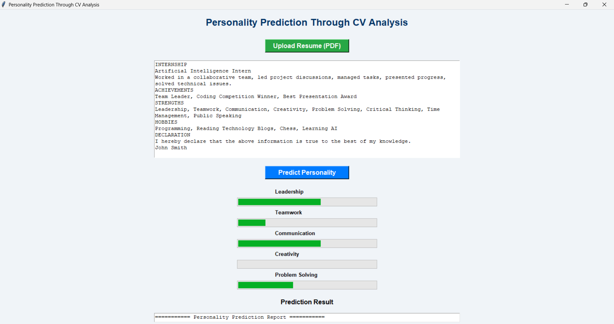

# Personality Prediction System Through CV Analysis

## 📌 Project Overview

The Personality Prediction System Through CV Analysis is an AI-based application developed using Python. It analyzes the content of a candidate's resume (CV) and predicts personality traits based on keywords found in the resume. The system also recommends a suitable job role according to the predicted personality.

This project was developed as part of an Artificial Intelligence Internship.

---

## 🎯 Features

- Upload Resume in PDF format
- Automatically extract text from the PDF
- Predict personality traits
- Display personality scores using progress bars
- Generate personality prediction report
- Recommend a suitable job role
- Show graphical representation of personality scores
- User-friendly GUI built with Tkinter

---

## 🛠 Technologies Used

- Python
- Tkinter
- PyPDF2
- Matplotlib
- NLTK
- TextBlob

---

## 📂 Project Structure

```
PersonalityPrediction

├── app.py
├── personality_model.py
├── pdf_reader.py
├── chart.py
├── report.py
├── README.md
├── requirements.txt
├── sample_resume.pdf
├── Output_Screenshot1.png
└── Output_Screenshot2.png

```

---

## ⚙️ Installation

### 1. Clone the Repository

```bash
git clone https://github.com/prasanna1292/CrixsoftSolution_PersonalityPrediction.git
```

### 2. Open the Project Folder

```bash
cd PersonalityPrediction
```

### 3. Install Required Libraries

```bash
pip install -r requirements.txt
```

### 4. Run the Project

```bash
python app.py
```

---

## 📖 How to Use

1. Run the application.
2. Click **Upload Resume (PDF)**.
3. Select a resume in PDF format.
4. Click **Predict Personality**.
5. View:
   - Personality Scores
   - Progress Bars
   - Dominant Personality Trait
   - Recommended Job Role
   - Personality Chart
6. The report is automatically saved as **Personality_Report.txt**.

---

## 📊 Personality Traits Analyzed

- Leadership
- Teamwork
- Communication
- Creativity
- Problem Solving

---

## 💼 Example Output

```
=========== Personality Prediction Report ===========

Leadership          : 60%
Teamwork            : 80%
Communication       : 40%
Creativity          : 80%
Problem Solving     : 100%

-----------------------------------------

Dominant Personality : Problem Solving

Recommended Role : Software Engineer

Analysis Completed Successfully!
```

---

## 📸 Project Screenshot

Add your application screenshot here.

Example:

```
Output_Screenshot.png
```

You can display it using:

```md

```

---

## 🚀 Future Enhancements

- Machine Learning based personality prediction
- Support for DOCX resumes
- Better Natural Language Processing (NLP)
- Resume score calculation
- Candidate ranking system
- Dark Mode Interface
- Export report as PDF

---

## 👨‍💻 Author

**Prasanna**

Artificial Intelligence Intern

---

## 📄 License

This project is developed for educational and internship purposes.